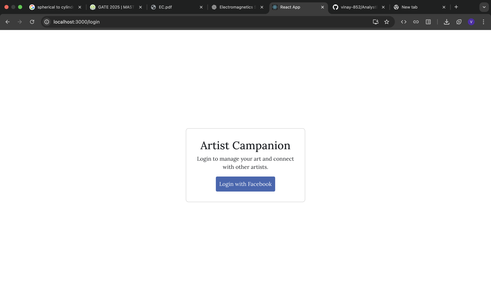

# Artist Companion (GoogleHackathon App)

## Overview

Artist Companion is a React web application designed for artists to manage their art, connect with other artists, and analyze their social media presence. The app integrates with Facebook to fetch business and page data, provides a dashboard for analytics, and offers tools for artist choice management and strategy planning.

## Features

- **Facebook Authentication**: Secure login using Facebook, with extensive permissions for managing and analyzing pages and Instagram accounts.
- **Protected Routes**: Only authenticated users can access the dashboard and main app features.
- **Dashboard**: Fetches and displays a list of Facebook pages managed by the user, including analytics like followers, likes, engagement, and more.
- **Artist Choices & Strategy**: Users can select a page, view details, and use tools like GeminiModal for strategy suggestions and summaries.
- **Context Management**: Uses React Context for authentication, selected page, and user choices.
- **Modern UI**: Includes a sidebar, header, floating chat box, and modal dialogs for a smooth user experience.

## Main Components

- `App.js`: Sets up routing. `/login` is public, `/` (dashboard) and `/main` (main app) are protected.
- `AuthContext.js`: Manages authentication state and access token.
- `PrivateRoute.js`: Protects routes, redirecting unauthenticated users to login.
- `dashboard.jsx`: Fetches Facebook pages and lets users select one to analyze.
- `login.jsx`: Handles Facebook login and sets the access token.
- `main.jsx`: Main app interface after selecting a page, with sidebar, header, chat, and modal for artist choices and strategies.

## Project Structure

- `public/`: Static files and assets.
- `src/`
  - `components/`: Shared React components (authentication, sidebar, chat, modal, etc.).
  - `pages/`: Main pages (dashboard, login, main).
  - `App.js`, `index.js`: Main entry points.

## Getting Started

1. Install dependencies:
	```bash
	npm install
	```
2. Start the development server:
	```bash
	npm start
	```

## Assets

This project includes the following assets located in the `assets/` folder:

| Image | Description |
|-------|-------------|
|  | Business details extracted from social media |
|  | Facebook login interface |
|  | Artist choices selection screen |
|  | Strategy based on social media data |
|  | Combined view: artist choices and social media details |

---
